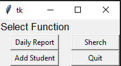
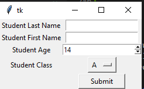
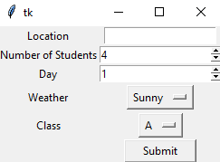
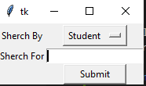

# digiproject1
eotc database
Hi  
this project is desigend to allow teacher to keep track of students on a eotc camp.  

# imporvments
there are sevral improvemts i am going to make to this program 
1. let users shearch by more values
2. readd the abilty to ammened the data in the tables 
3. fix the code i was perviosly using to make a bad version of a database (was removed due to causeing the program to crash unexpectly)
4. reduce the complexity of the code to improve the big O to somting better than O(n^2)

# testing
## Testing plan
|Input / Output etc|Name|Data Type / Scope|
|:--:|:--:|:--:|
|process|fields |undefined / global|
|process|rows |undefined / global|
|process|info |undefined / global|
|Input|sherchbox|string / global|
|process|newstudent|undefined / global|
|process|writeas|string / global|
|input|studentbox1|string / local|
|Input|studentbox2|string / local|
|input|studentbox3|string / local|
|process|reportdata|undefined / global|
|input|reportbox1|string / local|
|input|reportbox2|string / local|
|input|reportbox3|string / local|
|input|reportbox4|string / local|
|input|reportbox5|string / local|
|process|tedt|string / local|
|process|Check|string / local|

## usertesting
I took testing statements from three people here they are     
this first one is from my mum
```2. Observing User Behaviors  

What are you thinking as you view the start screen?  

   

  I’m not sure what I am asking for – what does it relate to 

   

   

If you were looking for help where would you expect to find it?  

  No idea 

   

How easy or difficult was it to navigate?  

  Would be easier if search was spelt correctly 

   

   

What are your thoughts on the design and layout?  

   

  Very simple 

   

End-to-End User Experience  

How would you describe your overall experience with the application?  

  Easy to use 

   

What did you like the most about using this application?  

  Easy to add student 

   

  Interface is overly simplistic 

   

   

What, if anything, surprised you about the experience?  

   

  There seem to be elements you might wan to record that aren’t included – health behavior issues, activities undertaken successful or not 

What, if anything, caused you frustration?  

  Would be better if given name was first 

   

Overall User Impression  

On a scale from 1 to 5 (1=not at all likely, 5=very likely), how likely are you to recommend this product to a friend?  

   

1          2          3          4          5  

Explain your rating… It successfully completes the requirements but could have added extras 

```
the next one is from xavi
```2. Observing User Behaviors  

What are you thinking as you view the start screen?  

   

  Easy, I know what I want to do and I know what to do even though I haven’t used it before 

   

If you were looking for help where would you expect to find it?  

  Ask the creator  

How easy or difficult was it to navigate?  

   

Very easy  

What are your thoughts on the design and layout?  

   

  Good design  

End-to-End User Experience  

How would you describe your overall experience with the application?  

Easy, some confusion with the searching the names of student but I understood what to do  

   

What did you like the most about using this application?  

The fact that I could add students in different areas of the app 

What did you like least 

  Nothing overall pretty good 

What, if anything, surprised you about the experience?  

  Nothing 

What, if anything, caused you frustration?  

  Nothing  

Overall User Impression  

On a scale from 1 to 5 (1=not at all likely, 5=very likely), how likely are you to recommend this product to a friend?  

   

1          2          3          4          5  

Explain your rating… It successfully completes the requirements but could have added extras 

   

  Fun and simpal  
```
and finale from archer
```2. Observing User Behaviors  

What are you thinking as you view the start screen?  

   

  It looks like it has a lot of detail but also as if it will be simple and easy for me to understand after a few moments to figure things out 

   

If you were looking for help where would you expect to find it?  

  

Chris is here 

   

How easy or difficult was it to navigate?  

   

It took a few moments to figure out what everything did but after that it was very easy for me to use. I found this very useful because it made everything easy to use which meant that everything was easy to use. It seems to have a lot of features that could be very useful for me to know about and be able to use. 

   

What are your thoughts on the design and layout?  

   

I think its laid out in a way which makes it so that everything is very easy to understand and to know how to do certain things 

   

End-to-End User Experience  

How would you describe your overall experience with the application?  

  

It seemed very Intuative which meant that it was intuative which helped because it meant that it was intuative. This was very helpful for me because I like when applications are intuative because it makes them easier to use because of how intuative they are   

  

What did you like the most about using this application?  

  

It had a lot of useful features that may be useful for me to have because useful features are useful and that means that they might be useful for something I need to do in the future. 

  

What did you like least 

  

At first the application seemed a little bit hard to use as if it may be complicated and this made me nervous at first but it was okay because the app turned out to be extremely intuitive and easy for me to use. This was unhelpful because looking at the start screen I could’ve turned around so I think it may have been a bit overengineered but it was okay because it turned out to be extremely easy for me to use. This was very helpful because at the start I was a bit nervous that it may have been a bit too complicated for me to use but it turned out to be very intuitive. This was useful because apps that are easy to use and figure out are much more appealing to me which made this app very appealing to me 

   

What, if anything, surprised you about the experience?  

   

The app was surprisingly simple to use despite having so many simple features. This was extremely helpful because it has a lot features that I wouldn’t expect to have been simple and easy to use but they were in fact quite easy for me to figure out how to use. 

  

What, if anything, caused you frustration?  

  

The only thing that caused me a slight bit of frustration would have to be the fact that at the beginning it looked like it may have been slightly complicated this almost turned me away because I thought it may have been really hard to use but it turned out to be really easy and simple for me to use as well as having a lot of very useful things for me to use as these helped me to be able to do whatever I needed to. The sherch function was a very helpful and useful thing for me to have as it allowed me to find certain things even if I wasn’t sure they were in the app at the moment as I could instead know that they were there. This helped me because it was useful to avoid confusion which meant that it was less confusing 

   

Overall User Impression  

On a scale from 1 to 5 (1=not at all likely, 5=very likely), how likely are you to recommend this product to a friend?  

   

1          2          3          4          5  

Explain your rating… It successfully completes the requirements but could have added extras 

   

   

   

The app was extremely simple and easy for me to use as well as having a lot of features that I wouldn’t have expected from an app that was so simple and easy to use. Although some of the spelling was a bit off such as how he labelled the search function sherch which kind of threw me off for a bit because I wasn’t sure what he meant. Overall an amazing app with few improvements that could be made. 
```
# screencaps
this is the start up screen it is basicly just a four way menu     
   
this window lets you add new students     
   
this is the daly report logger i think this was the main part of the breif     
    
and finaly the sherch window and the results table        



# planing 
here is some proof of planing


# bugs
## solved bugs
one of the majoir bugs that the program currently has is when a user shurches by day the program returns several copies of each window 

this is because of the the code surches though the data it does this by itarating tough the values of the array for each key so it returns mulatple times   
                          
                          Check = sherchbox.get()  
                          for i in data:      
                             for e in i.values():  
                                 if Check in e: 
                                   info = i  
                         
                         sherchoutput(info)```  
as you can see in the code sample above this wont be to hard to fix        
        
fix the dropdown menu in sherach   

## unsolved bugs


