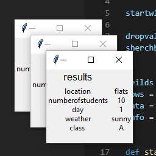

# digiproject1
eotc database
Hi<br>
this project is desigend to allow teacher to keep track of students on a eotc camp.<br>
<h1>
bugs
</h1>
one of the majoir bugs that the program currently has is when a user shurches by day the program returns several copies of each window 

this is because of the the code surches though the data it does this by itarating tough the values of the array for each key so it returns mulatple times
``` Check = sherchbox.get()
    for i in data:
        for e in i.values():
            if Check in e:
                info = i
                sherchoutput(info)```
