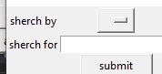
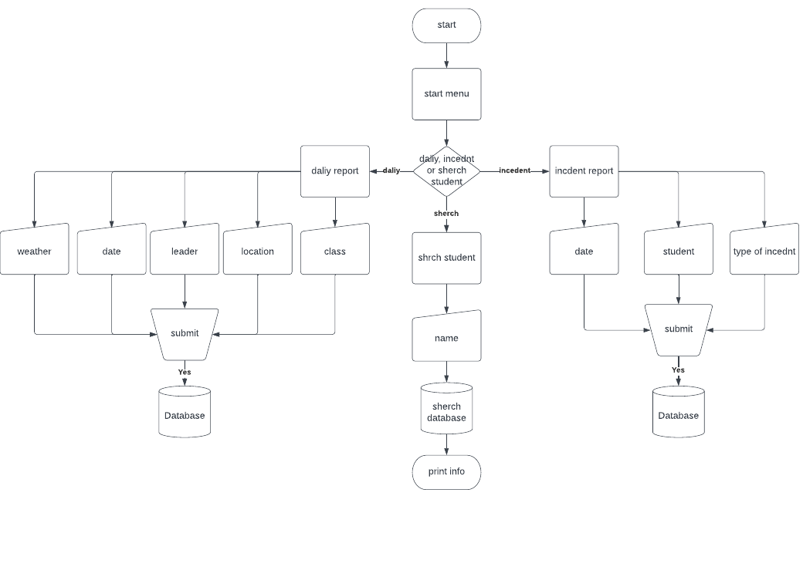

# digiproject1
eotc database
Hi  
this project is desigend to allow teacher to keep track of students on a eotc camp.  
# bugs
## solved bugs
one of the majoir bugs that the program currently has is when a user shurches by day the program returns several copies of each window 

this is because of the the code surches though the data it does this by itarating tough the values of the array for each key so it returns mulatple times   
                          
                          Check = sherchbox.get()  
                          for i in data:      
                             for e in i.values():  
                                 if Check in e: 
                                   info = i  
                         
                         sherchoutput(info)```  
as you can see in the code sample above this wont be to hard to fix   
## unsolved bugs

# imporvments
there are sevral improvemts i am going to make to this program 
1. fix the dropdown menu in sherach   
 
2. let users shearch by more values
3. readd the abilty to ammened the data in the tables 
4. fix the code i was perviosly using to make a bad version of a database (was removed due to causeing the program to crash unexpectly)
5. reduce the complexity of the code to improve the big O to somting better than O(n^2)

# testing
## Testing plan
|Input / Output etc|Name|Data Type / Scope|
|:--:|:--:|:--:|
|process|fields |undefined / global|
|process|rows |undefined / global|
|process|info |undefined / global|
|Input|sherchbox|string / global|
|process|newstudent|undefined / global|
|process|writeas|string / global|
|input|studentbox1|string / local|
|Input|studentbox2|string / local|
|input|studentbox3|string / local|
|process|reportdata|undefined / global|
|input|reportbox1|string / local|
|input|reportbox2|string / local|
|input|reportbox3|string / local|
|input|reportbox4|string / local|
|input|reportbox5|string / local|
|process|tedt|string / local|
|process|Check|string / local|


# planing 
here is some proof of planing


